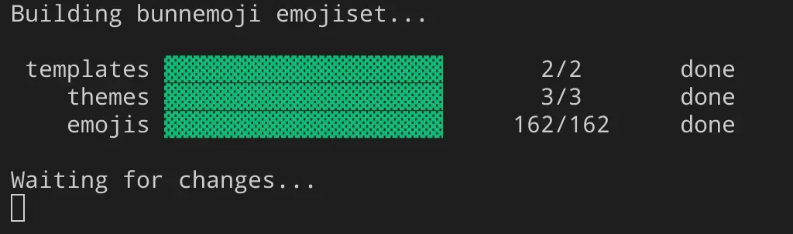

# emoji crafter

a command line tool for automating emoji exports from svg, including animation.




## installation

emoji crafter can be installed using cargo:

```sh
cargo install emoji-crafter
```


## how it works

to create a new emojiset project, just use the `new` command and provide the path/name for your project:

```sh
emoji new my-emojis
```

then change into the new project directory that the command created.

to export your emojiset run either:

```sh
emoji build # to build once
emoji watch # to build on file change
```


### manifest format

the emojiset manifest file (`emoji.toml`), used for defining what assets are used by the project, and what will be exported at build time.

```toml
[emojiset]
# human readable name for the project
name = "my emojis"
# the main svg file that contains
# emoji to be exported
document = "emojiset.svg"
# editor stylesheet, imported in the
# document and only used for styling
# while editing
stylesheet = "emojiset.css"

[[theme]]
# human readable name for the theme
name = "my emojis"
# all files exported using this
# theme will have their filenames
# prefixed with this
prefix = ""
# stylesheet used for rendering
# emoji for the theme
stylesheet = "themes/my emojis.css"

[[output]]
# not all platforms work well with
# emoji that aren't square, so the
# option to trim is disabled
trim = false
directory = "original"

[[output]]
# some platforms work best with the
# transparent parts cropped from
# the emoji
trim = true
directory = "trimmed"
```

in addition to what's defined on project creation, you can also define templates to render text files:

```toml
[[template]]
# path to the template
input = "my template.tpl"
# where the template should be saved
output = "my document.md"
```

you can use <a href="https://docs.rs/tinytemplate/latest/tinytemplate/syntax/index.html">tinytemplate</a> syntax to build your templates.


### emojiset format

each emoji is a group that has a desc which contains some toml describing how that group should be exported. for a static image emoji, it looks like:

```toml
type = "image"
# name of the emoji, prefixed with
# a theme name on export
name = "bunne"
```

animations are much the same:

```toml
type = "animation"
name = "bunnehop"
```

however they also contain groups which make up the individual frames of the animation:

```toml
type = "frame"
# delay before the next frame in ms
delay = 60
# animation timeline position
position = 1
```

---

<sup>yes i am allergic to capital letters, no i will not spell bunne correctly</sup>